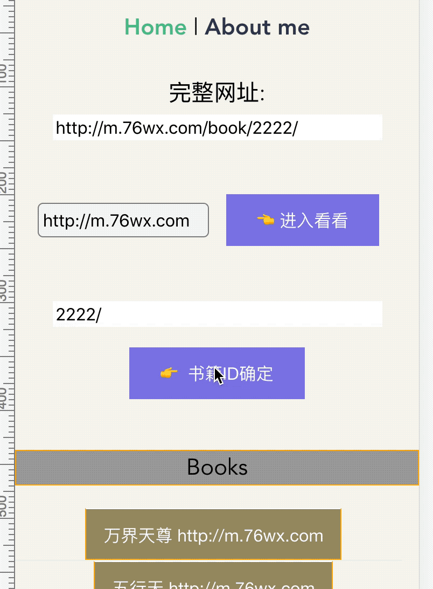

## getNoAbsBooks by client

[ getNoAbsBooks by server](https://github.com/chinanf-boy/getNoAbsBooks)

如果我自己不用, 也就没有写出来的必要了

---

广告不想要, 看过来 http://llever.com/getNoAbsBooks

---

### 1. 书籍确定

进入看看

> 新开一个 http://m.76wx.com 页面 

书籍ID确定 

- 如果确定✅成功, 可以在主页面书籍列表出现

- 转到 解码 页面

- 总得来说, 如果添加其他书站网页, 肯定会有失败的时候❌

这个时候, 就需要用到 下面的`第二种方式`

### 2. 解码页面

你可以在 http://llever.com/getNoAbsBooks/#/ 后面 复制/粘贴 你想看到的书网页

> 在这里就是 http://www.aileleba.com/155516/zhangjie38984080.shtml

> 因为有缓存, 所以这么快而已

⚠️ 这里可以解析更多的书页, 但并不是全部的

, 而这样看得书, 主页面书籍列表是不会保存的

---

### 如何存储

用 jsonStore 存储 书「也就是主页书单」, 不过只有在 点击 `书籍ID确定` 才有效果

然后就这样

### 特性

- [x] 自动阅读
- [x] 没有广告

---
- 😊
- 😊
---
